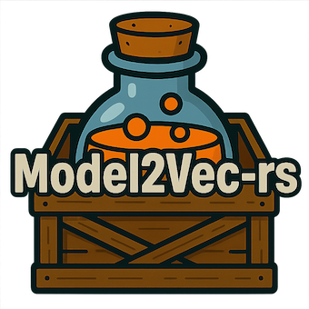

<div align="center">
    <picture>
      
    </picture>
</div>

<div align="center">

[Quickstart](#quickstart) •
[Models](#models) •
[Performance](#performance)
</div>

This crate provides a lightweight Rust implementation for loading and inference of [Model2Vec](https://github.com/MinishLab/model2vec) static embedding models. For distillation and training, the [Python Model2Vec package](https://github.com/MinishLab/model2vec) can be used.


## Quick Start

Add the crate:

```bash
cargo add model2vec-rs
```

Make embeddings:

```rust
use anyhow::Result;
use model2vec_rs::model::StaticModel;

fn main() -> Result<()> {
    // Load a model from the Hugging Face Hub or a local path
    // args = (repo_or_path, token, normalize, subfolder)
    let model = StaticModel::from_pretrained("minishlab/potion-base-8M", None, None, None)?;

    // Prepare a list of sentences
    let sentences = vec![
        "Hello world".to_string(),
        "Rust is awesome".to_string(),
    ];

    // Create embeddings
    let embeddings = model.encode(&sentences);
    println!("Embeddings: {:?}", embeddings);

    Ok(())
}
```


Make embeddings with the CLI:

```rust
# Single sentence
cargo run -- encode "Hello world" minishlab/potion-base-8M

# Multiple lines from a file
echo -e "Hello world\nRust is awesome" > input.txt
cargo run -- encode input.txt minishlab/potion-base-8M --output embeds.json
```


Make embeddings with custom encode args:

```rust
let embeddings = model.encode_with_args(
    &sentences,     // input texts
    Some(512),  // max length
    1024,       // batch size
);
```

## Models

We provide a number of models that can be used out of the box. These models are available on the [HuggingFace hub](https://huggingface.co/collections/minishlab/model2vec-base-models-66fd9dd9b7c3b3c0f25ca90e) and can be loaded using the `from_pretrained` method. The models are listed below.


| Model                                                                 | Language    | Sentence Transformer                                            | Params  | Task      |
|-----------------------------------------------------------------------|------------|-----------------------------------------------------------------|---------|-----------|
| [potion-base-32M](https://huggingface.co/minishlab/potion-base-32M)   | English    | [bge-base-en-v1.5](https://huggingface.co/BAAI/bge-base-en-v1.5) | 32.3M   | General   |
| [potion-base-8M](https://huggingface.co/minishlab/potion-base-8M)     | English    | [bge-base-en-v1.5](https://huggingface.co/BAAI/bge-base-en-v1.5) | 7.5M    | General   |
| [potion-base-4M](https://huggingface.co/minishlab/potion-base-4M)     | English    | [bge-base-en-v1.5](https://huggingface.co/BAAI/bge-base-en-v1.5) | 3.7M    | General   |
| [potion-base-2M](https://huggingface.co/minishlab/potion-base-2M)     | English    | [bge-base-en-v1.5](https://huggingface.co/BAAI/bge-base-en-v1.5) | 1.8M    | General   |
| [potion-retrieval-32M](https://huggingface.co/minishlab/potion-retrieval-32M) | English    | [bge-base-en-v1.5](https://huggingface.co/BAAI/bge-base-en-v1.5) | 32.3M   | Retrieval |
| [M2V_multilingual_output](https://huggingface.co/minishlab/M2V_multilingual_output) | Multilingual | [LaBSE](https://huggingface.co/sentence-transformers/LaBSE)      | 471M    | General   |


## Performance

We compared the performance of the Rust implementation with the Python version of Model2Vec. The benchmark was run single-threaded on a CPU.

| Implementation | Throughput                                         |
| -------------- | -------------------------------------------------- |
| **Rust**       | 8000 sentences |
| **Python**     | 4650 sentences |

The Rust version is roughly **1.7×** faster than the Python version.


## License

MIT